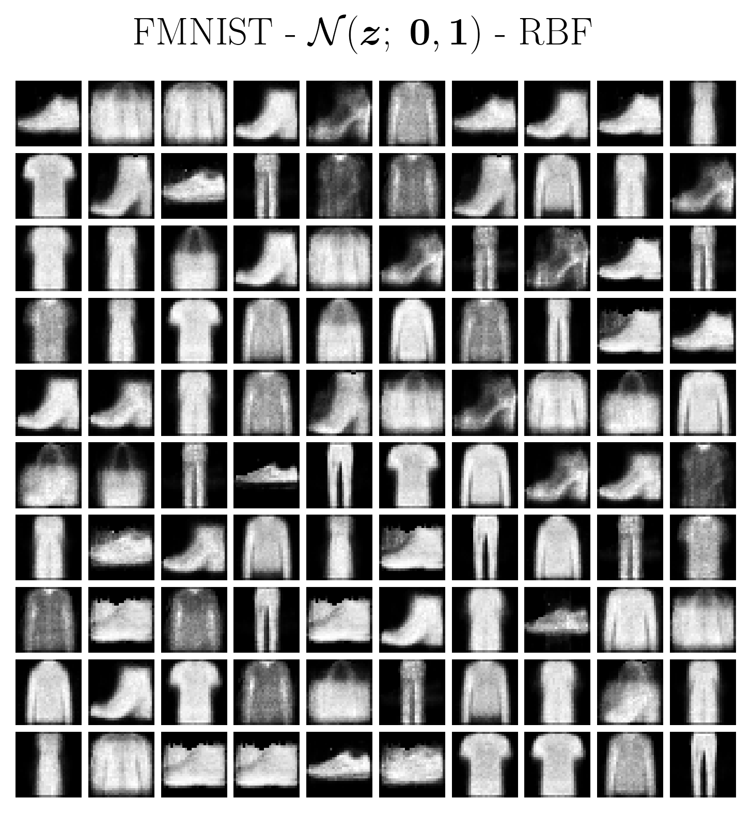
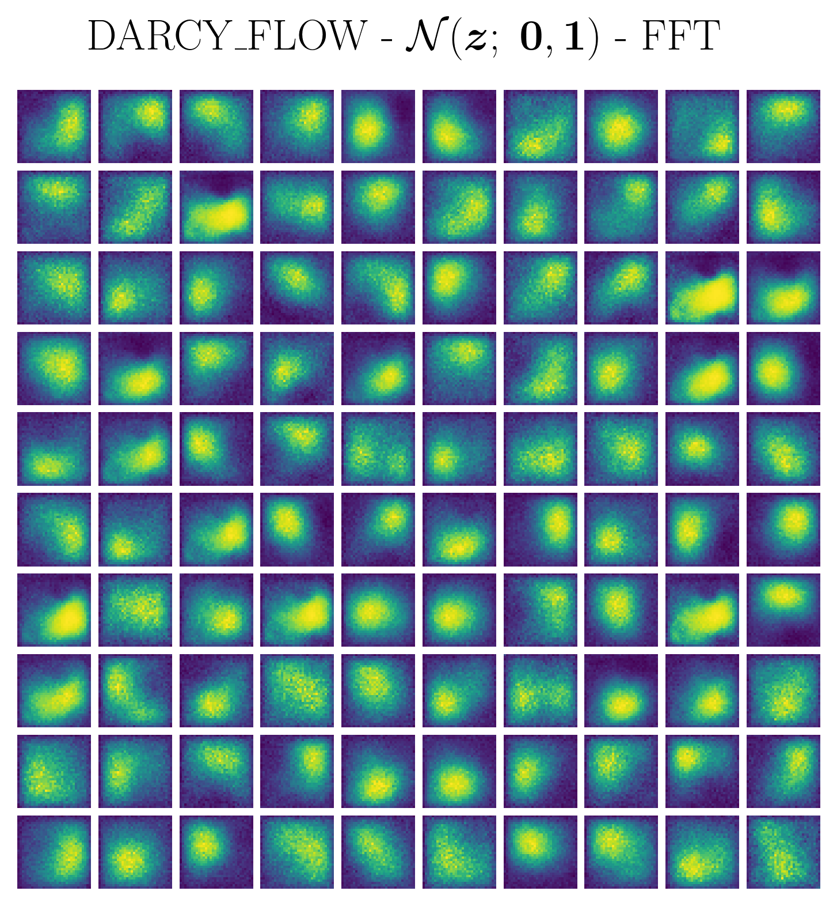
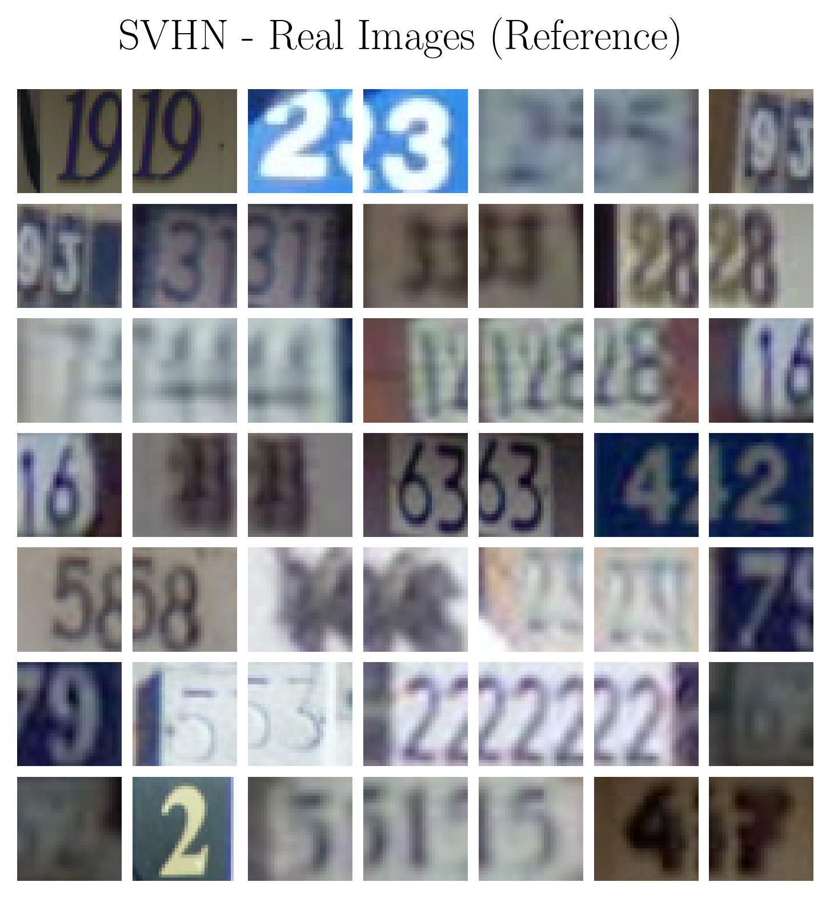
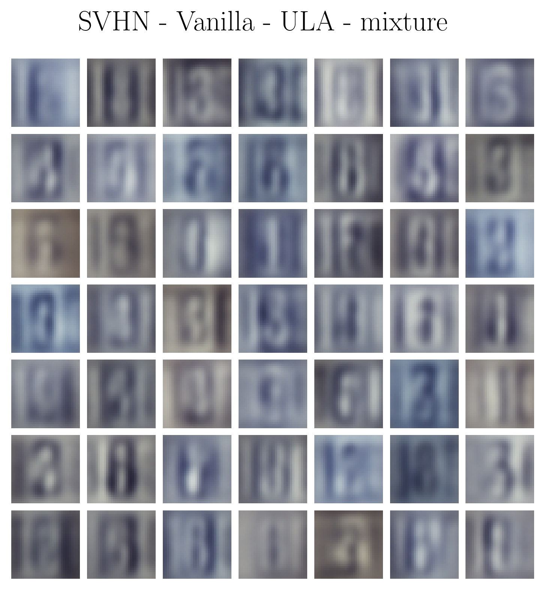
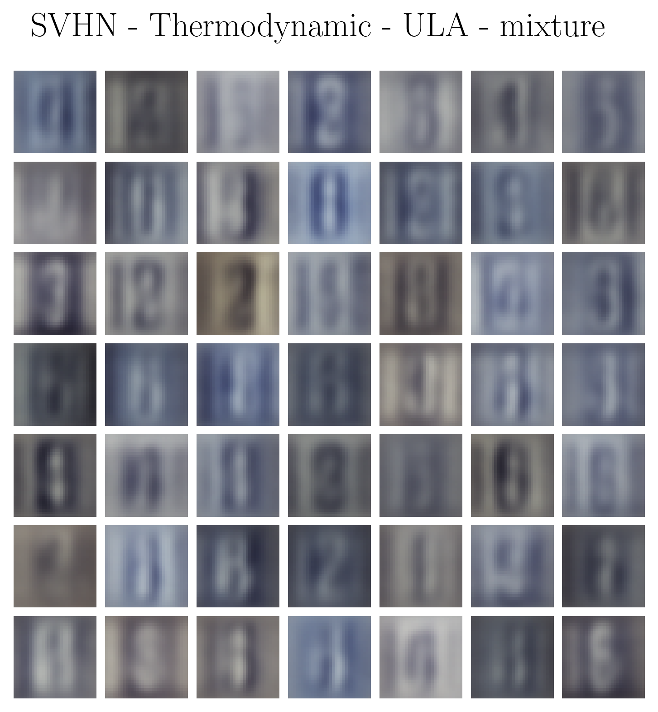

# T-KAM 

T-KAM is a generative model presented [here](https://www.arxiv.org/abs/2506.14167) to be explained at a later date.

## Setup:

Need [Conda](https://docs.conda.io/projects/conda/en/latest/user-guide/install/index.html) and [Julia](https://github.com/JuliaLang/juliaup). Choose your favourite installer and run: 

```bash
bash <conda-installer-name>-latest-Linux-x86_64.sh
curl -fsSL https://install.julialang.org | sh
```

Then install

```bash
make install
```

[Optional;] Test all Julia scripts:

```bash
make test
```

### Note for windows users:

This repo uses shell scripts solely for convenience, you can run everything without them too. If you want to use the shell scripts, [WSL](https://learn.microsoft.com/en-us/windows/wsl/install) is recommended.

## Make commands:

List commands:
```
make help
```

Edit the config files:

```bash
vim config/nist_config.ini
```

For individual experiments run:

```bash
make train-vanilla DATASET=MNIST
make train-thermo DATASET=SVHN
```

To automatically run experiments one after the other:
```bash
vim jobs.txt # Schedule jobs
make train-sequential CONFIG=jobs.txt
```

For benchmarking run:

```bash
make bench
```

## How to sample

T-KAM is uniquely structured to be able to work without an encoder, score-based approximations, and even MCMC (depending on conditions).

Fast and unbiased sampling can be feasible with:
- **Inverse transform sampling** from the prior (inference)
- **Importance sampling** for the posterior (training)

<p align="center">
  
  
  
</p>

When importance sampling fails, the unadjusted Langevin algorithm (ULA) can be used for posterior sampling instead. Prior sampling can still proceed by inverse transform to preserve fast inference post-training. When ULA and maximum likelihood fail, T-KAM can also be trained with a strategy based on Thermodynamic Integration:

<p align="center">

  
  
</p>

## Julia flow:

With trainer (preferable):

```julia
using ConfParser, Random

include("src/pipeline/trainer.jl")
using .trainer

t = init_trainer(
      rng, 
      conf, # See config directory for examples
      dataset_name; 
      img_resize = (16,16), # Downsize for prototyping
      file_loc = loc
)
train!(t)
```

Without trainer:

```julia
using Random, Lux, Enzyme, ComponentArrays, Accessors

include("src/T-KAM/T-KAM.jl")
include("src/T-KAM/model_setup.jl")
include("src/utils.jl")
using .T_KAM_model
using .ModelSetup
using .Utils

model = init_T_KAM(
      dataset, 
      conf, 
      x_shape; 
      file_loc = file_loc, 
      rng = rng
)

# Parse config to setup sampling and training criterions
x, loader_state = iterate(model.train_loader)
x = pu(x)
model, ps, st_kan, st_lux = prep_model(model, x; rng = rng) 
ps_hq = half_quant.(ps) # Mixed precision will return NaN train loss, but grads will be defined

grads = Enzyme.make_zero(ps_hq) # or zero(ps_hq)
loss, grads, st_ebm, st_gen = model.loss_fcn(
      ps_hq,
      grads,
      st_kan,
      st_lux,
      model,
      x;
      train_idx = 1, # Only affects temperature scheduling in thermo model
      rng = Random.default_rng()
)

# States reset with Accessors.jl:
@reset st.ebm = st_ebm
@reset st.gen = st_gen
```

## Citation/license [](https://opensource.org/licenses/MIT)

The MIT license open-sources the code. The paper is licensed separately with CC license - also open with citation:

```bibtex
@misc{raj2025structuredgenerativemodelingthermodynamic,
      title={Structured Generative Modeling with the Thermodynamic Kolmogorov-Arnold Model}, 
      author={Prithvi Raj},
      year={2025},
      eprint={2506.14167},
      archivePrefix={arXiv},
      primaryClass={cs.LG},
      url={https://arxiv.org/abs/2506.14167}, 
}
```
